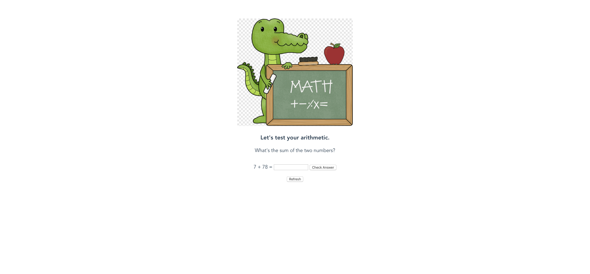

# alligator-test



## Description
Toy calculator app created for the purposes of a tutorial on testing Vue components for the site alligator.io. The post will come out before the end of March with the title **Introduction to Testing Vue.js with Jest**.

## Project setup
```
npm install
```

### Compiles and hot-reloads for development
```
npm run serve
```

### Compiles and minifies for production
```
npm run build
```

### Run your tests
```
npm run test
```

### Lints and fixes files
```
npm run lint
```

### Customize configuration
See [Configuration Reference](https://cli.vuejs.org/config/).
